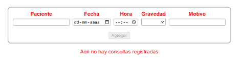
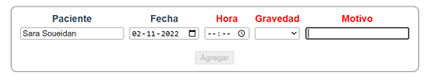
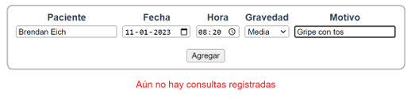
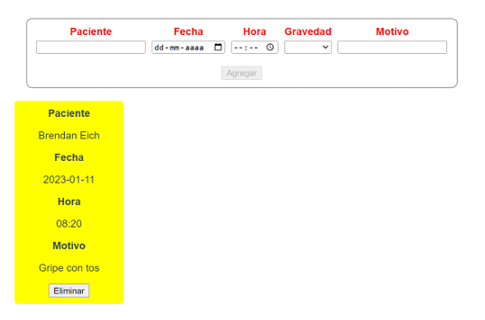
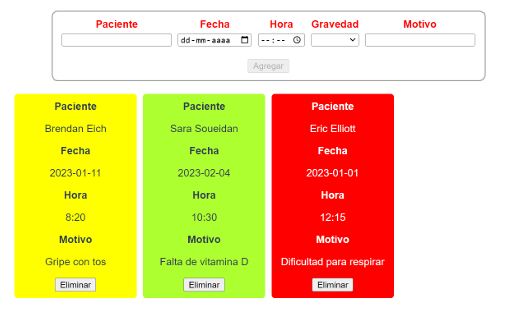

# Desafío - Manejo de eventos y reutilización de componentes

💡 Realizado [cristiandpto23](https://github.com/cristiandpto23) con HTML y JS 
➡ Front-End G17 - Desafío Latam 
🔗 Desplegado en Vercel [aquí](https://desafio-manejo-eventos-y-reutilizacion-componentes.vercel.app/) 

En este desafío validaremos nuestros conocimientos del manejo de eventos y reutilización de componentes.

## Descripción

En este desafío crearemos un pequeño administrador de citas médicas.

En donde deberemos tener un formulario con los siguientes campos:

-   Paciente
-   Fecha
-   Hora
-   Gravedad
-   Motivo

Los labels del formulario deberán estar de color rojo mientras que su input correspondiente esté vacío, de lo contrario deberán retornar su color natural (negro).

El botón **Agregar** deberá mantenerse deshabilitado hasta que todos los campos del formulario tengan valor.

Debajo del formulario deberá mostarse un mensaje indicando que aún no hay consultas registradas mientras no se registre ninguna cita.

Una vez agregada una cita se deben limpiar los campos del formulario y renderizar la información de las citas en un formato de tarjeta (card).

Cada cita debe ser una renderización dinámica de un componente hijo que reciba por medio de **props** la información de la cita.

Cada gravedad definida en las citas debe definir el color de fondo de la tarjeta relacionada.

Los diferentes niveles y colores pueden ser:

-   Baja: Verde
-   Media: Amarilla
-   Alta: Rojo

Finalmente, se debe programar la interacción para el botón **Eliminar**, la cual debe ser un evento emitido al componente padre para su eliminación del arreglo donde se están registrando las consultas.

## Requerimientos

1. Utilizar los eventos y las modificaciones para agregar interacciones en la aplicación.
2. Reutilizar componentes para el ahorro de tiempo en el desarrollo de una aplicación
3. Hacer uso de las **props** para el paso de datos a componentes hijos.
4. Cambiar los estilos de elementos a partir de eventos emitidos por el usuario.
5. Comunicar componentes hijos con sus padres a través de la emisión de eventos.

    
